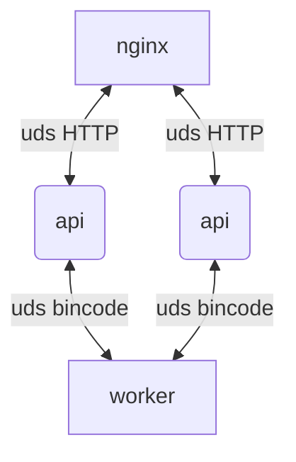

# Rinha de Backend 2025 — Rust

Implementação da Rinha de Backend 2025 utilizando:

- [Rust](https://www.rust-lang.org/) apenas a melhor linguagem de todas
- [UDS](https://en.wikipedia.org/wiki/Unix_domain_socket) unix domain sockets para comunicação IPC (evitando a network stack, especialmente na rede bridge do docker)
- [Nginx](https://nginx.org/) load balancer ultra performático

---

## Arquitetura



## Executando o binário

Este projeto define um único binário que pode rodar em dois modos:

### Modo API

Responsável por receber as requisições encaminhadas pelo Nginx e enviar para o worker processar e consultar o worker para obter o summary.

```bash
cargo run --release -- -m api
```

### Modo Worker

Responsável por armazenar os pagamentos localmente em memória Vec<T>.

```bash
cargo run --release -- -m worker
```
